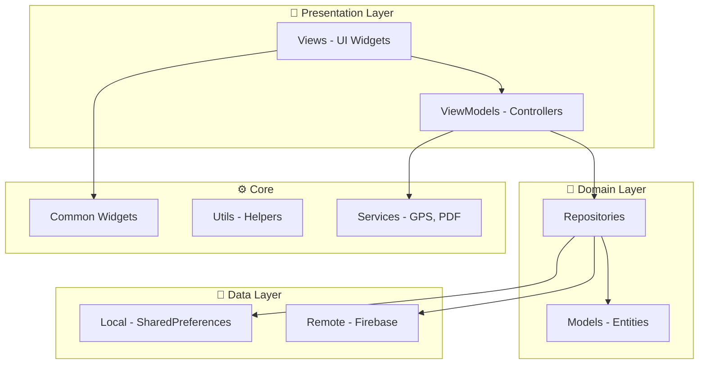
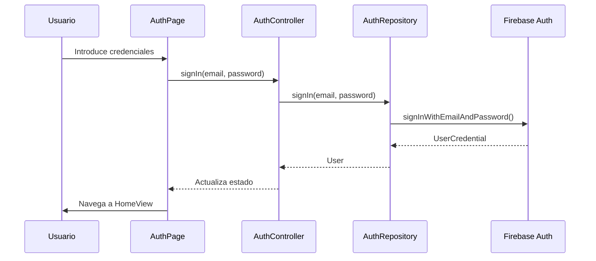
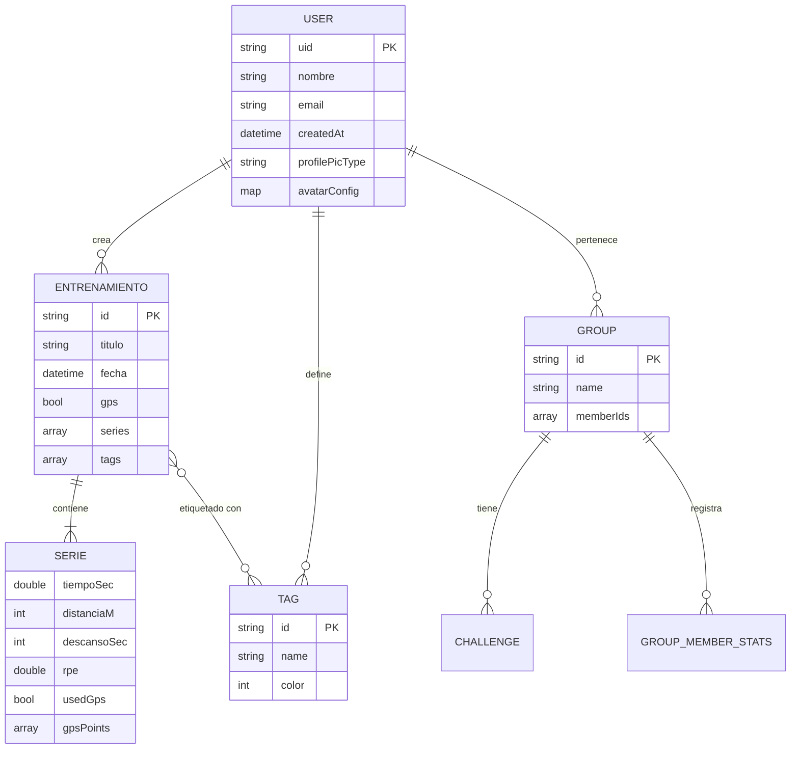
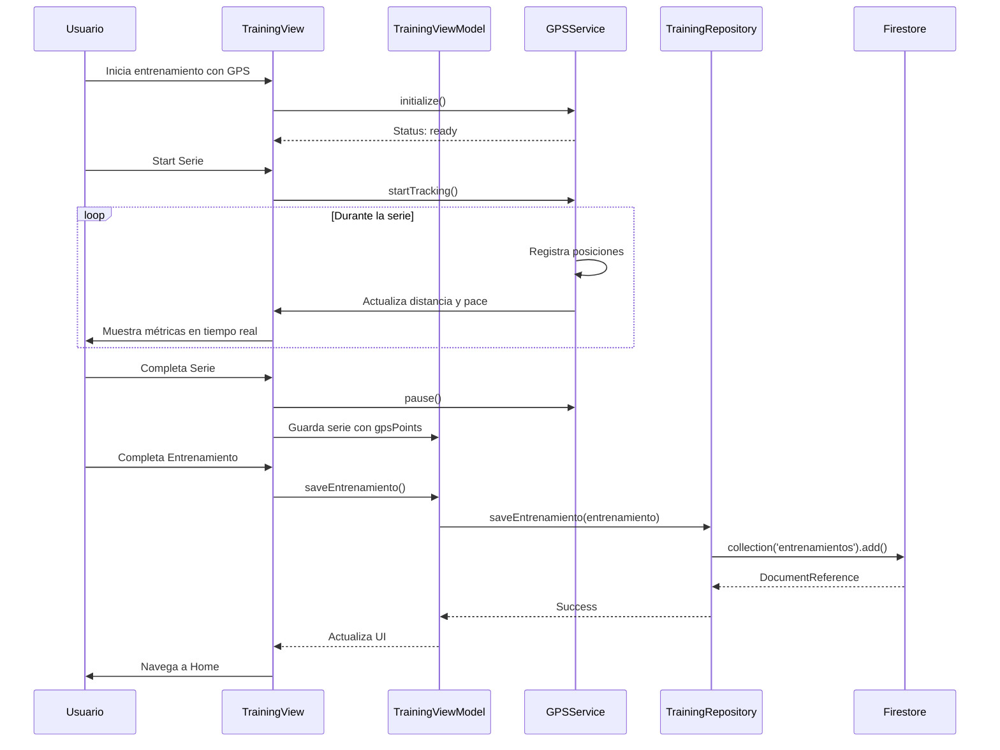

# 📋 Running Laps - Documentación Técnica Completa

> **Versión:** 1.0.0  
> **Última actualización:** Diciembre 2025  
> **Autores:** Mario, Álvaro

---

## 📌 Índice

1. [Visión General del Proyecto](#-visión-general-del-proyecto)
2. [Arquitectura del Sistema](#-arquitectura-del-sistema)
3. [Stack Tecnológico](#-stack-tecnológico)
4. [Estructura del Proyecto](#-estructura-del-proyecto)
5. [Módulos Principales (Features)](#-módulos-principales-features)
6. [Modelos de Datos](#-modelos-de-datos)
7. [Servicios Core](#-servicios-core)
8. [Integración con Firebase](#-integración-con-firebase)
9. [Gestión de Estado](#-gestión-de-estado)
10. [Componentes UI Reutilizables](#-componentes-ui-reutilizables)
11. [Flujo de Datos](#-flujo-de-datos)
12. [Configuración y Desarrollo](#-configuración-y-desarrollo)
13. [Mejoras Futuras](#-mejoras-futuras)

---

## 🎯 Visión General del Proyecto

**Running Laps** es una aplicación móvil multiplataforma desarrollada en Flutter que revoluciona el entrenamiento de running mediante el enfoque en **series (intervalos)** y **esfuerzo percibido (RPE)**.

### Características Diferenciadoras

- ✅ **Entrenamiento por Series**: Gestión completa de intervalos con tiempos de trabajo y descanso
- ✅ **RPE (Rate of Perceived Exertion)**: Escala 1-10 para medir esfuerzo subjetivo
- ✅ **GPS Tracking Avanzado**: Rastreo en tiempo real con métricas de ritmo y distancia
- ✅ **Análisis Estadístico**: Gráficas y tendencias de rendimiento
- ✅ **Social y Competitivo**: Grupos, rankings y desafíos entre corredores
- ✅ **Personalización Completa**: Sistema de avatares personalizable y etiquetas (tags)

### Público Objetivo

Corredores que practican entrenamientos fraccionados (intervalos, fartlek, cambios de ritmo) y necesitan:
- Registro preciso de series individuales
- Análisis del esfuerzo percibido
- Tracking GPS por serie
- Historial detallado de entrenamientos

---

## 🏗️ Arquitectura del Sistema

### Patrón Arquitectónico: Feature-First + MVVM

El proyecto sigue una arquitectura **modular** basada en features (funcionalidades), donde cada módulo implementa el patrón **MVVM** (Model-View-ViewModel).



### Capas de la Arquitectura

#### 1. **Presentation Layer** (Capa de Presentación)
- **Views**: Widgets de Flutter que renderizan la UI
- **ViewModels/Controllers**: Lógica de presentación, gestión de estado con `ValueNotifier`

#### 2. **Domain Layer** (Capa de Dominio)
- **Models**: Entidades de negocio (Entrenamiento, Serie, GroupModel, etc.)
- **Repositories**: Abstracciones para acceso a datos

#### 3. **Data Layer** (Capa de Datos)
- **Remote**: Clases que interactúan con Firebase (Firestore, Auth)
- **Local**: Gestión de datos locales con SharedPreferences

#### 4. **Core Layer** (Capa Transversal)
- **Services**: Servicios compartidos (GPS, generación de PDF)
- **Utils**: Utilidades y helpers
- **Widgets**: Componentes UI reutilizables

---

## 🛠️ Stack Tecnológico

### Framework y Lenguaje

| Componente | Tecnología | Versión |
|------------|------------|---------|
| **Framework UI** | Flutter | 3.x+ |
| **Lenguaje** | Dart | 3.9.2+ |
| **Estado** | ValueNotifier | Nativo |
| **Backend (BaaS)** | Firebase | - |

### Dependencias Principales

```yaml
# Firebase
firebase_core: ^4.2.0
firebase_auth: ^6.1.1
cloud_firestore: ^6.0.3
firebase_storage: ^13.0.3

# Geolocalización y Mapas
geolocator: ^11.0.0

# UI y Visualización
fl_chart: ^1.1.1          # Gráficas
table_calendar: ^3.0.9    # Calendario
flutter_svg: ^2.0.7       # SVG para avatares

# Utilidades
intl: ^0.18.1             # Internacionalización
shared_preferences: ^2.0.0 # Almacenamiento local
get: ^4.6.5               # Navegación y gestión de estado
image_picker: ^1.2.0      # Selección de imágenes
pdf: ^3.11.1              # Generación de PDFs
printing: ^5.13.3         # Impresión de PDFs
gal: ^2.3.0               # Galería
path_provider: ^2.0.15    # Rutas del sistema
flutter_ringtone_player: ^4.0.0+4 # Sonidos de notificación
```

### Plataformas Soportadas

- ✅ Android
- ✅ iOS
- ⚠️ Web (funcionalidad limitada de GPS)
- ✅ Windows
- ✅ macOS
- ⚠️ Linux

---

## 📂 Estructura del Proyecto

```
lib/
├── app/
│   └── tema.dart                          # Tema y estilos globales
│
├── core/                                  # Componentes transversales
│   ├── services/
│   │   ├── gps_service.dart              # Servicio de geolocalización
│   │   └── pdf_generator_service.dart    # Generación de PDFs
│   ├── utils/
│   │   └── tag_utils.dart                # Utilidades para tags
│   ├── widgets/
│   │   ├── app_footer.dart               # Footer reutilizable
│   │   ├── app_header.dart               # Header reutilizable
│   │   ├── group_skeleton_card.dart      # Skeleton loader
│   │   └── modern_snackbar.dart          # Snackbar personalizado
│   ├── auth_failure.dart                 # Manejo de errores de autenticación
│   ├── constants.dart                    # Constantes globales
│   └── utils.dart                        # Utilidades generales
│
├── features/                             # Módulos funcionales
│   ├── auth/                             # Autenticación
│   │   ├── data/
│   │   │   ├── auth_remote.dart          # Comunicación con Firebase Auth
│   │   │   └── auth_repository.dart      # Repositorio de autenticación
│   │   ├── viewmodels/
│   │   │   └── auth_controller.dart      # Controlador de autenticación
│   │   └── views/
│   │       └── auth_page.dart            # Vista de login/registro
│   │
│   ├── avatar/                           # Creador de avatares
│   │   ├── data/
│   │   │   ├── assets.dart               # Gestión de assets SVG
│   │   │   └── background_shape.dart     # Formas de fondo
│   │   ├── viewmodels/
│   │   │   └── avatar_maker_controller.dart
│   │   ├── views/
│   │   │   └── avatar_maker_screen.dart
│   │   └── widgets/
│   │       ├── avatar_color_picker.dart
│   │       └── avatar_text_styles.dart
│   │
│   ├── groups/                           # Sistema de grupos
│   │   ├── group/                        # Detalle de grupo
│   │   │   ├── data/
│   │   │   │   ├── challenge_model.dart
│   │   │   │   └── group_detail_repository.dart
│   │   │   ├── logic/
│   │   │   │   └── gamification_service.dart
│   │   │   └── view/
│   │   │       ├── challenge_detail_screen.dart
│   │   │       ├── group_detail_screen.dart
│   │   │       └── participant_profile_screen.dart
│   │   ├── home/                         # Lista de grupos
│   │   │   ├── data/
│   │   │   │   └── groups_repository.dart
│   │   │   └── view/
│   │   │       └── groups_home_screen.dart
│   │   ├── group_model.dart
│   │   └── invitation_model.dart
│   │
│   ├── home/                             # Pantalla principal
│   │   ├── data/
│   │   │   └── homeEstadistica_repository.dart
│   │   ├── viewmodels/
│   │   │   └── homeEstadistica_Controller.dart
│   │   ├── views/
│   │   │   └── home_view.dart
│   │   └── widgets/
│   │       ├── history_carousel.dart     # Carrusel de historial
│   │       ├── legacy_bar_chart.dart     # Gráfica de barras
│   │       └── stats_carousel.dart       # Carrusel de estadísticas
│   │
│   ├── profile/                          # Perfil y analíticas
│   │   ├── data/
│   │   │   └── (repositorios de perfil)
│   │   ├── viewmodels/
│   │   │   ├── analytics_view_model.dart
│   │   │   └── profile_controller.dart
│   │   └── views/
│   │       ├── analytics_detail_screen.dart
│   │       ├── analytics_screen.dart
│   │       ├── avatar_editor_wrapper_view.dart
│   │       ├── edit_profile_picture_view.dart
│   │       ├── history_screen.dart
│   │       ├── profile_menu_screen.dart
│   │       └── widgets/
│   │           ├── history_calendar_widget.dart
│   │           └── history_filter_sheet.dart
│   │
│   └── training/                         # Entrenamientos
│       ├── data/
│       │   ├── entrenamiento.dart        # Modelo de entrenamiento
│       │   ├── serie.dart                # Modelo de serie
│       │   ├── tag_manager.dart          # Gestión de etiquetas
│       │   ├── tag_model.dart            # Modelo de etiqueta
│       │   └── training_repository.dart  # Repositorio de entrenamientos
│       ├── viewmodels/
│       │   └── training_viewmodel.dart   # Controlador de entrenamientos
│       ├── views/
│       │   └── (vistas de entrenamiento)
│       └── widgets/
│           └── (componentes de entrenamiento)
│
├── firebase_options.dart                 # Configuración de Firebase
└── main.dart                            # Punto de entrada de la aplicación
```

---

## 🎨 Módulos Principales (Features)

### 1. **Auth** - Autenticación

**Responsabilidad**: Gestión completa de autenticación y autorización de usuarios.

#### Componentes Clave

- **`AuthRepository`**: Capa de abstracción para operaciones de autenticación
  - `signIn()`: Inicio de sesión con email/password
  - `signUp()`: Registro de nuevos usuarios
  - `signOut()`: Cierre de sesión
  - `sendPasswordResetEmail()`: Recuperación de contraseña
  - `authStateChanges()`: Stream de cambios de estado de autenticación

- **`AuthController`**: ViewModel que gestiona el estado de la UI de autenticación

- **`AuthPage`**: Vista principal de login/registro

#### Flujo de Autenticación



---

### 2. **Training** - Entrenamientos

**Responsabilidad**: Core de la aplicación, gestiona entrenamientos por series.

#### Modelos de Datos

##### **`Entrenamiento`** (Clase principal)

```dart
class Entrenamiento {
  final String? id;           // ID del documento en Firestore
  final String titulo;        // Título del entrenamiento
  final DateTime fecha;       // Fecha de realización
  final bool gps;            // ¿Se usó GPS?
  final List<Serie> series;  // Lista de series del entrenamiento
  final List<String>? tags;  // Etiquetas (ej: "tempo", "fartlek")
  
  // Métodos calculados
  int distanciaTotalM();      // Suma de distancias de todas las series
  double tiempoTotalSec();    // Suma de tiempos de todas las series
  double rpePromedio();       // Promedio de RPE de todas las series
  int ritmoMedioSecPorKm();   // Ritmo medio del entrenamiento
  String ritmoMedioTexto();   // Ritmo formateado "mm:ss /km"
}
```

##### **`Serie`** (Clase de serie individual)

```dart
class Serie {
  final double tiempoSec;     // Tiempo de la serie en segundos
  final int distanciaM;       // Distancia en metros
  final int descansoSec;      // Descanso posterior en segundos
  final double rpe;           // Esfuerzo percibido (1-10)
  
  // GPS opcionales
  final bool? usedGps;             // ¿Usó GPS?
  final bool? usedGpsDistance;     // ¿Se eligió distancia GPS?
  final List<Map<String, dynamic>>? gpsPoints; // Puntos del recorrido
  
  // Métodos calculados
  int ritmoSecPorKm();        // Ritmo de la serie
  String ritmoTexto();        // Ritmo formateado
}
```

#### Sistema de Tags (Etiquetas)

**`TagManager`**: Gestiona etiquetas personalizables para entrenamientos

```dart
class TagManager {
  // Operaciones CRUD
  Future<void> saveTag(String userId, TagModel tag);
  Future<List<TagModel>> loadTags(String userId);
  Future<void> deleteTag(String userId, String tagId);
  Future<void> updateTag(String userId, TagModel tag);
}
```

**`TagModel`**: Modelo de etiqueta

```dart
class TagModel {
  final String id;      // ID único
  final String name;    // Nombre (ej: "Tempo Run")
  final int color;      // Color en formato ARGB
}
```

#### Características Destacadas

- ✅ **Validación robusta**: No se pueden crear series de 0 metros
- ✅ **GPS por serie**: Cada serie puede tener su propio tracking GPS
- ✅ **Cálculos automáticos**: Ritmos y totales se calculan automáticamente
- ✅ **Sincronización Firestore**: Persistencia automática en la nube

---

### 3. **Home** - Pantalla Principal

**Responsabilidad**: Dashboard con estadísticas y acceso rápido a funcionalidades.

#### Componentes

- **`HomeView`**: Vista principal con gráficas y estadísticas
- **`HomeEstadisticaController`**: Gestión de métricas y rangos temporales
- **`HomeEstadisticaRepository`**: Carga de datos estadísticos

#### Widgets Destacados

- **`LegacyBarChart`**: Gráfica de barras con gradiente (fl_chart)
- **`StatsCarousel`**: Carrusel de estadísticas principales
- **`HistoryCarousel`**: Carrusel de entrenamientos recientes

#### Métricas Disponibles

```dart
enum HomeMetric {
  ritmoMedio,      // Ritmo medio en el período
  distanciaTotal,  // Km totales
  totalSeries,     // Número de series
  rpePromedio      // RPE promedio
}

enum TimeRange {
  oneWeek,    // Última semana
  oneMonth,   // Último mes
  threeMonths // Últimos 3 meses
}
```

---

### 4. **Profile** - Perfil y Analíticas

**Responsabilidad**: Gestión de perfil de usuario y análisis avanzado de rendimiento.

#### Pantallas Principales

##### **`ProfileMenuScreen`**
- Información de usuario
- Estadísticas generales
- Configuración de perfil
- Edición de avatar

##### **`AnalyticsScreen`**
Análisis detallado con gráficas premium:
- **Overview**: KPIs principales (entrenamientos totales, km, ritmo medio)
- **Trends**: Tendencias temporales con gráficas de línea y barras
- **Charts**: Gráficas de pastel (donut) por tags

##### **`HistoryScreen`**
Historial completo de entrenamientos con:
- **Calendario**: Vista de calendario con marcadores de entrenamiento
- **Filtros**: Por tags, rango de fechas
- **Lista**: Entrenamientos con detalles

#### Componentes Destacados

- **`HistoryCalendarWidget`**: Calendario con TableCalendar mostrando días con entrenamientos
- **`HistoryFilterSheet`**: Bottom sheet para filtrar entrenamientos

---

### 5. **Groups** - Sistema Social

**Responsabilidad**: Creación de grupos, competición y gamificación.

#### Estructura

##### **Grupos (`GroupModel`)**

```dart
class GroupModel {
  final String id;                    // ID del grupo
  final String name;                  // Nombre del grupo
  final List<String> memberIds;       // IDs de miembros
  final List<GroupMemberStats>? topRunners; // Top corredores
}
```

##### **Estadísticas de Miembros (`GroupMemberStats`)**

```dart
class GroupMemberStats {
  final String uid;           // ID del usuario
  final String name;          // Nombre
  final double totalKm;       // Kilómetros totales
  final String? photoUrl;     // URL de foto (si usa imagen)
  final String? profilePicType; // Tipo: 'avatar' o 'photo'
  final Map<String, dynamic>? avatarConfig; // Config del avatar
}
```

##### **Desafíos (`ChallengeModel`)**

Sistema de desafíos dentro de grupos con objetivos y rankings.

#### Pantallas

- **`GroupsHomeScreen`**: Lista de grupos del usuario
- **`GroupDetailScreen`**: Detalle de grupo con ranking
- **`ChallengeDetailScreen`**: Detalle de desafío
- **`ParticipantProfileScreen`**: Perfil de participante

#### Servicio de Gamificación

**`GamificationService`**: Gestiona lógica de puntos, badges y rankings.

---

### 6. **Avatar** - Creador de Avatares

**Responsabilidad**: Sistema personalizable de creación de avatares con SVG.

#### Características

- ✅ Múltiples categorías de personalización:
  - Cabeza y cabello (corto/largo)
  - Ojos, nariz, boca
  - Accesorios faciales (barba, bigote)
  - Ropa
  - Accesorios de cabeza
  - Forma de fondo

- ✅ Sistema de colores personalizables
- ✅ Renderizado en tiempo real
- ✅ Guardado en Firebase Storage

#### Estructura de Assets

```
assets/avatar/
├── accessories/         # Accesorios generales
├── body/               # Formas de cuerpo
├── clothing/           # Ropa
├── eyes/               # Ojos
├── facial hair/        # Vello facial
├── head/
│   ├── accessories/    # Gorros, gafas
│   └── hair/
│       ├── long/       # Cabello largo
│       └── short/      # Cabello corto
├── mouth/              # Bocas
└── nose/               # Narices
```

---

## 📊 Modelos de Datos

### Relaciones entre Modelos



### Almacenamiento en Firestore

#### Colecciones Principales

```
users/
  {userId}/
    ├── nombre: string
    ├── email: string
    ├── createdAt: timestamp
    ├── profilePicType: "avatar" | "photo"
    ├── avatarConfig: map
    └── subcollections:
        ├── entrenamientos/
        │   {entrenamientoId}/
        │       ├── titulo: string
        │       ├── fecha: string (ISO 8601)
        │       ├── gps: boolean
        │       ├── tags: array<string>
        │       ├── series: array<map>
        │       ├── distanciaTotalM: number
        │       ├── tiempoTotalSec: number
        │       ├── rpePromedio: number
        │       └── ritmoMedioSecKm: number
        │
        └── tags/
            {tagId}/
                ├── name: string
                └── color: number

groups/
  {groupId}/
    ├── name: string
    ├── members: array<string>
    └── subcollections:
        └── challenges/
            {challengeId}/
                ├── title: string
                ├── startDate: timestamp
                └── endDate: timestamp
```

---

## ⚙️ Servicios Core

### 1. **GPS Service** (`GPSService`)

Gestión completa de geolocalización en tiempo real.

#### Estados del Servicio

```dart
enum GpsStatus {
  uninitialized,    // No inicializado
  permissionDenied, // Permisos denegados
  disabled,         // GPS desactivado
  ready,            // Listo para usar
  active,           // Tracking activo
  paused,           // Tracking pausado
  error             // Error general
}
```

#### Modelo de Puntos GPS

```dart
class GpsPoint {
  final double latitude;   // Latitud
  final double longitude;  // Longitud
  final double? altitude;  // Altitud (opcional)
  final double? accuracy;  // Precisión (metros)
  final DateTime timestamp; // Marca temporal
}
```

#### Funcionalidades Principales

```dart
class GPSService {
  // Observables
  ValueNotifier<GpsStatus> status;
  ValueNotifier<List<GpsPoint>> allPoints;
  ValueNotifier<List<GpsPoint>> currentSeriesPoints;
  ValueNotifier<int> totalDistanceMeters;
  ValueNotifier<int> currentSeriesDistanceMeters;
  ValueNotifier<int> averagePaceSecKm;
  
  // Métodos principales
  Future<void> initialize();
  Future<void> startTracking();
  void pause();
  void resume();
  void stopTracking();
  void reset();
}
```

#### Características Avanzadas

- ✅ **Filtrado de puntos**: Elimina puntos con baja precisión (>20m)
- ✅ **Ventana deslizante**: Últimos 5 puntos para cálculo de ritmo
- ✅ **Cálculo de distancia**: Fórmula de Haversine para distancia entre coordenadas
- ✅ **Ritmo en tiempo real**: Actualización continua del pace promedio
- ✅ **Gestión de permisos**: Solicitud y verificación de permisos de ubicación

---

### 2. **PDF Generator Service** (`PDFGeneratorService`)

Generación y exportación de reportes de entrenamientos en PDF.

#### Funcionalidades

```dart
class PDFGeneratorService {
  // Generar PDF de entrenamiento
  Future<void> generateTrainingPDF(Entrenamiento entrenamiento);
  
  // Generar PDF de múltiples entrenamientos (resumen)
  Future<void> generateSummaryPDF(List<Entrenamiento> entrenamientos);
  
  // Guardar en galería
  Future<void> saveToGallery(Document pdf, String filename);
  
  // Compartir PDF
  Future<void> sharePDF(Document pdf);
}
```

#### Contenido del PDF

- 📄 **Header**: Título, fecha
- 📊 **Resumen**: Distancia total, tiempo total, ritmo medio
- 📈 **Tabla de series**: Serie por serie con métricas
- 🏷️ **Tags**: Etiquetas del entrenamiento
- 🗺️ **Mapa GPS**: (si disponible) Renderizado del recorrido

---

## 🔥 Integración con Firebase

### Firebase Products Utilizados

| Producto | Uso Principal |
|----------|---------------|
| **Authentication** | Login/registro con email/password |
| **Firestore** | Base de datos NoSQL para todos los datos |
| **Storage** | Almacenamiento de avatares y fotos |

### Reglas de Seguridad Firestore (Recomendadas)

```javascript
rules_version = '2';
service cloud.firestore {
  match /databases/{database}/documents {
    // Usuarios solo pueden leer/escribir sus propios datos
    match /users/{userId} {
      allow read, write: if request.auth != null && request.auth.uid == userId;
      
      // Entrenamientos del usuario
      match /entrenamientos/{entrenamientoId} {
        allow read, write: if request.auth != null && request.auth.uid == userId;
      }
      
      // Tags del usuario
      match /tags/{tagId} {
        allow read, write: if request.auth != null && request.auth.uid == userId;
      }
    }
    
    // Grupos: lectura si eres miembro, escritura si eres admin
    match /groups/{groupId} {
      allow read: if request.auth != null && 
                     request.auth.uid in resource.data.members;
      allow write: if request.auth != null && 
                      request.auth.uid == resource.data.adminId;
    }
  }
}
```

### Inicialización Firebase

```dart
// main.dart
void main() async {
  WidgetsFlutterBinding.ensureInitialized();
  
  await Firebase.initializeApp(
    options: DefaultFirebaseOptions.currentPlatform,
  );
  
  runApp(const MyApp());
}
```

---

## 🔄 Gestión de Estado

### Patrón: ValueNotifier

El proyecto utiliza **`ValueNotifier`** nativo de Flutter para gestión de estado reactivo.

#### Ventajas

- ✅ **Simplicidad**: No requiere dependencias externas
- ✅ **Rendimiento**: Rebuild selectivo de widgets
- ✅ **Testeable**: Fácil de testear
- ✅ **Flutter-native**: Integración nativa con `ValueListenableBuilder`

#### Ejemplo de Uso

```dart
// ViewModel/Controller
class TrainingViewModel {
  final ValueNotifier<bool> isLoading = ValueNotifier(false);
  final ValueNotifier<List<Entrenamiento>> entrenamientos = ValueNotifier([]);
  
  Future<void> loadEntrenamientos() async {
    isLoading.value = true;
    final data = await _repository.getEntrenamientos();
    entrenamientos.value = data;
    isLoading.value = false;
  }
  
  void dispose() {
    isLoading.dispose();
    entrenamientos.dispose();
  }
}

// Vista
ValueListenableBuilder<bool>(
  valueListenable: controller.isLoading,
  builder: (context, loading, _) {
    if (loading) return CircularProgressIndicator();
    return /* contenido */;
  },
)
```

---

## 🎨 Componentes UI Reutilizables

### Core Widgets

#### 1. **`AppHeader`**
Header reutilizable con gradiente, botón de retroceso y acciones.

```dart
AppHeader(
  title: "Mi Pantalla",
  showBackButton: true,
  actions: [IconButton(...)],
)
```

#### 2. **`AppFooter`**
Footer con navegación entre pantallas principales.

```dart
AppFooter(
  currentIndex: 0,
  onIndexChanged: (index) { /* navegar */ },
)
```

#### 3. **`ModernSnackbar`**
Snackbar con diseño premium y iconos.

```dart
ModernSnackbar.show(
  context: context,
  message: "Entrenamiento guardado",
  type: SnackbarType.success,
  icon: Icons.check_circle,
)
```

#### 4. **`GroupSkeletonCard`**
Skeleton loader para carga de grupos.

```dart
GroupSkeletonCard() // Muestra durante carga
```

---

## 🔁 Flujo de Datos

### Flujo Completo: Crear Entrenamiento con GPS



---

## ⚙️ Configuración y Desarrollo

### Requisitos Previos

- **Flutter SDK**: 3.x o superior
- **Dart SDK**: 3.9.2 o superior
- **Firebase CLI**: Para configuración de Firebase
- **Cuenta de Firebase**: Acceso al proyecto

### Paso 1: Clonar Repositorio

```bash
git clone https://github.com/tu-usuario/running-laps.git
cd running-laps
```

### Paso 2: Instalar Dependencias

```bash
flutter pub get
```

### Paso 3: Configurar Firebase

#### Opción A: Usar Firebase existente del proyecto

El proyecto ya incluye `firebase_options.dart` con la configuración. Necesitas tener acceso al proyecto Firebase vinculado.

#### Opción B: Crear tu propio proyecto Firebase

1. Instalar FlutterFire CLI:
```bash
dart pub global activate flutterfire_cli
```

2. Configurar proyecto:
```bash
flutterfire configure
```

3. Seleccionar/crear proyecto Firebase

4. Habilitar servicios:
   - **Firebase Authentication**: Email/Password
   - **Cloud Firestore**: Base de datos
   - **Firebase Storage**: Almacenamiento

### Paso 4: Ejecutar la App

```bash
# Android
flutter run

# iOS (requiere Mac)
flutter run -d ios

# Web
flutter run -d chrome

# Windows
flutter run -d windows
```

### Comandos Útiles

```bash
# Limpiar build
flutter clean

# Verificar configuración
flutter doctor

# Generar iconos de la app
flutter pub run flutter_launcher_icons

# Build APK para Android
flutter build apk --release

# Build iOS (en Mac)
flutter build ios --release
```

---

## 🧪 Testing

### Estructura de Tests (Planificado)

```
test/
├── unit/
│   ├── models/
│   │   ├── entrenamiento_test.dart
│   │   └── serie_test.dart
│   ├── repositories/
│   │   └── training_repository_test.dart
│   └── services/
│       └── gps_service_test.dart
├── widget/
│   └── (tests de widgets)
└── integration/
    └── (tests de integración)
```

### Ejecutar Tests

```bash
# Todos los tests
flutter test

# Un archivo específico
flutter test test/unit/models/entrenamiento_test.dart

# Con coverage
flutter test --coverage
```

---

##  Mejoras Futuras

### Prioridad Alta

- [ ] **Sincronización Offline**: 
  - Implementar cache local con `Hive` o `Drift`
  - Sincronizar cuando vuelva conexión

- [ ] **Notificaciones Push**:
  - Firebase Cloud Messaging
  - Recordatorios de entrenamiento
  - Notificaciones de grupo

- [ ] **Mapa de Ruta GPS**:
  - Integrar `google_maps_flutter`
  - Visualizar recorrido en mapa
  - Exportar track GPX

### Prioridad Media

- [ ] **Planes de Entrenamiento**:
  - Crear planes semanales/mensuales
  - Plantillas predefinidas (5K, 10K, media maratón)

- [ ] **Objetivos y Logros**:
  - Sistema de badges
  - Objetivos personalizados (ej: "100km en un mes")

- [ ] **Compartir en Redes Sociales**:
  - Generar imágenes para compartir
  - Integración con Strava, Garmin

### Prioridad Baja

- [ ] **Modo Oscuro**:
  - Tema dark completo
  - Detección automática del sistema

- [ ] **Internacionalización**:
  - Soporte multi-idioma (inglés, español)
  - Usar paquete `intl` para traducciones

- [ ] **Apple Watch / Wear OS**:
  - Compañía para registro desde wearables

---

## 📝 Convenciones de Código

### Estilo Dart

Seguir [Effective Dart](https://dart.dev/guides/language/effective-dart):

```dart
// ✅ Nombres de clases: PascalCase
class TrainingController { }

// ✅ Nombres de archivos: snake_case
// training_controller.dart

// ✅ Nombres de variables y métodos: camelCase
final int totalDistance;
void calculatePace() { }

// ✅ Constantes: lowerCamelCase
const double maxRpe = 10.0;
```

### Estructura de Archivos

```dart
// 1. Imports
import 'dart:async';
import 'package:flutter/material.dart';
import 'package:firebase_core/firebase_core.dart';

// 2. Definiciones
class MiClase {
  // 3. Campos
  final String field;
  
  // 4. Constructor
  MiClase({required this.field});
  
  // 5. Métodos públicos
  void publicMethod() { }
  
  // 6. Métodos privados
  void _privateMethod() { }
}
```

---

## 🤝 Contribuir al Proyecto

### Git Workflow

1. **Crear rama** desde `main`:
```bash
git checkout -b feature/nueva-funcionalidad
```

2. **Commits** descriptivos:
```bash
git commit -m "feat: Añadir gráfica de ritmo en AnalyticsScreen"
```

3. **Push** y crear **Pull Request**:
```bash
git push origin feature/nueva-funcionalidad
```

### Convención de Commits

- `feat:` Nueva funcionalidad
- `fix:` Corrección de bug
- `refactor:` Refactorización de código
- `docs:` Documentación
- `style:` Cambios de estilo (formato)
- `test:` Añadir tests
- `chore:` Tareas de mantenimiento

---

## 📞 Contacto y Soporte

### Equipo de Desarrollo

| Desarrollador | Rol | Contacto |
|---------------|-----|----------|
| **Mario** | Lead Developer | - |
| **Álvaro** | Lead Developer | - |

### Recursos Adicionales

- **Documentación Flutter**: https://docs.flutter.dev
- **Firebase Docs**: https://firebase.google.com/docs
- **Dart Packages**: https://pub.dev

---

## 📄 Licencia

Este proyecto es de uso **educativo y académico**.  
© 2025 Running Laps Team - DAM 2025

---

## 🎓 Conclusión

Este documento proporciona una visión completa de la arquitectura, componentes y flujos de **Running Laps**. Con esta información, cualquier desarrollador puede:

✅ Entender la estructura del proyecto  
✅ Navegar el código eficientemente  
✅ Añadir nuevas funcionalidades  
✅ Mantener y mejorar el sistema  
✅ Colaborar en el desarrollo

**¡Happy Coding! 🏃‍♂️💨**
